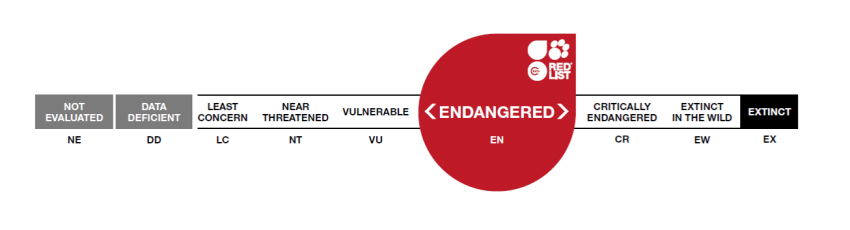
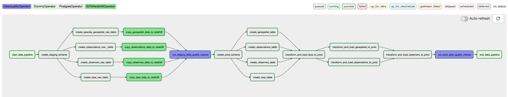
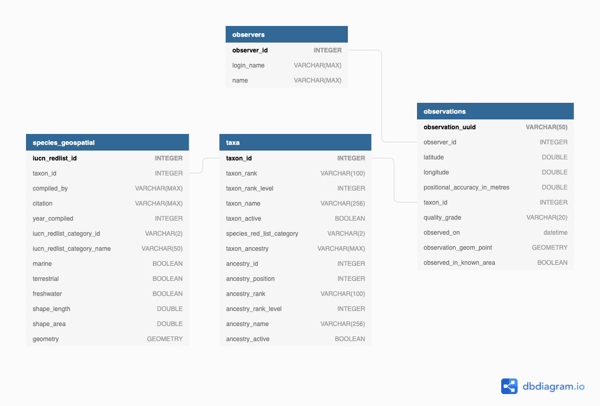

## Introduction
This is my capstone project for the [Udacity Data Engineering Nanodegree](https://www.udacity.com/course/data-engineer-nanodegree--nd027) which I successfully completed in February 2022. My project was self defined and required me to develop an end-to-end data pipeline using the technology and skills learnt during the earlier modules of this degree. 

This project uses Apache Airflow to automate a data pipeline in order to generate a data warehouse of iNaturalist Licenced 
Observation Open Image Data and International Union for Conservation of Nature (IUCN) Red List spatial data.

By combining citizen-science observations from iNaturalist with IUCN Red list spatial data, analysts will be able to 
explore the relationship between the known species distributions (spatial data) and what is being observed by citizen scientists. 

These insights could inform future research efforts. 

## Project Scope
I have limited the project scope to species in the class "Amphibia". In 2022, 41% of all Amphibian species are threatened with extinction (source: [iucnredlist.org](https://www.iucnredlist.org), February 2022). 
While the project scope will be limited to Amphibia, the data model has been designed to be applicable to 
observation and spatial data for all living organisms.

Some use cases for this data model could be: 
1. How many users have contributed to Amphibian species observations per year?
2. Are observations within the bounds of the known species distribution (plot observations co-ordinates with species distribution)?
3. Should the species distribution be reassessed? 
4. Are users observing data-deficient or endangered species?
5. Where are most of our observations coming from?
6. Are there iNaturalist super-users who are could be approached for future research efforts?  

## Repository Setup Instructions 
The [Setup Instructions file](setup_instructions.md) details the instructions required to get this repository working locally. 

## Datasets 
### Introduction to the Data
#### [iNaturalist Licensed Observation Images Open Dataset]((https://registry.opendata.aws/inaturalist-open-data))
iNaturalist is a popular nature application where users can record and share plant and animal images coupled with observation data. 
The app has a built-in peer review system that allows users to suggest or confirm identifications for their own or other users' observations, respectively. 
In addition to species identification, users can specify the location (latitude and longitude) of the observation.  
iNatualist records millions of research-grade observations that can be used for research and conservation efforts. 

The iNaturalist Licensed Observation Images Open Dataset is one of the largest public datasets of images of living organisms.
This open dataset is housed on and can be sourced from Amazon S3. 

This project uses the following observation metadata, available as compressed (gzip) comma-separated-values (csv) files: 
1. Taxa - a comprehensive list of taxon_ids for living organism observations
2. Observers - data about the user who made each observation
3. Observations - A record of individual observations of living organisms

Note for the purposes of this project we will not use the image data. 

#### [International Union for Conservation of Nature (IUCN) Red List Spatial Data](https://www.iucnredlist.org/resources/spatial-data-download)
> The IUCN Red List of Threatened Species™ contains global assessments for more than 142,500 species. More than 80% of these (>115,000 species) have spatial data.

These assessments classify species according to one of the following categories: 
- Not Evaluated
- Data Deficient
- Least Concern
- Near Threatened
- Vulnerable
- Endangered
- Extinct in the Wild
- Extinct

These classifications, as well as spatial data, are important for environmental impact assessments and the protection of wildlife. 
Spatial data in the ESRI shapefile format can be downloaded from [iucnredlist.org](https://www.iucnredlist.org/resources/spatial-data-download).
For this project, I downloaded the Amphibia shapefile which includes polygon shapes for: 

- Tailless Amphibians (species from the order Anura)
- Tailed Amphibians (species from the order Caudata)
- Caecilian Amphibians (species from the order Gymnophiona)

### Data References
1. *iNaturalist Licensed Observation Images* was first accessed on 2022-01-01 from [https://registry.opendata.aws/inaturalist-open-data.](https://registry.opendata.aws/inaturalist-open-data)
2. *IUCN Spatial Data Download* version 2021-3 on 2021-12-23 from [https://www.iucnredlist.org/resources/spatial-data-download](https://www.iucnredlist.org/resources/spatial-data-download)

### Data Exploration
Data exploration can be viewed in the [Data Exploratory Analysis Notebook](Notebooks/dataset_exploratory_analysis.ipynb)

## Project Tools 
This project uses the following tools to generate an extract-load-transform (ELT) data pipeline: 
- Amazon S3 (source of the data)
- Amazon Redshift (data warehouse)
- Apache Airflow (managing pipeline tasks)

### Amazon S3 
The [`iNaturalist Open Dataset`](https://registry.opendata.aws/inaturalist-open-data/) 
is currently stored and updated with metadata on a monthly basis on Amazon S3. 
I have uploaded the IUCN Amphibian geospatial shapefile to my own S3 bucket and imported this data from there. 

### Amazon Redshift
Data from Amazon S3 is copied directly into staging tables in an Amazon Redshift cluster database. 
Data processing, quality checks, and transformations are conducted within the Redshift database in order to leverage the computing power of the cluster.

### Apache Airflow 
The data pipeline is orchestrated by Apache Airflow. As the iNaturalist Open data is uploaded to the Open dataset monthly,
the Airflow DAG is set to run every month starting from January 1st, 2022.

Each run of this pipeline overwrites data loaded in previous runs. This is to ensure that updates to existing records 
are loaded in correctly. 
Historical iNaturalist observation records can be updated at any time; even months or years after the observation was made. 
For example, a user can suggest an identification for an observation made 5 years ago which would result in that observation record being updated.

The data pipeline executes the following tasks: 
1. Instructs Redshift to set up a staging schema for raw data tables. 
2. Instructs Redshift to create staging tables if these do not already exist.
3. Instructs Redshift to copy / load csv and shapefile data from Amazon S3 into the Redshift staging tables. If there is existing data in the table, 
this data is overwritten. 
4. Instructs Redshift to execute data quality queries against staging tables. 
5. Instructs Redshift to set up a production schema for the data model. 
6. Instructs Redshift to create production tables if these do not already exist.
7. Instructs Redshift to truncate the existing production table data and load in data based on the data transformation queries. 
8. Instructs Redshift to perform data quality checks on the production tables.

The pipeline graph is shown below:

## Data Model 
The data model was designed to facilitate data analytics based on the questions outlined in the Project Scope Section.

The data model has one fact table called `species observations`. The data in the source iNauturalist `observation` table is filtered to include species observations 
from the Amphibia class. 

The dimension tables: 
- `taxa` - hierarchical dimension table facilitating easy grouping / roll-ups of taxons 
- `observers` - a filtered table showing users who have made at least one Amphibia observation 
- `species_geospatial` - geospatial data specific to species. This also includes the IUCN Red List Category 

The image below shows the data model created using [dbdiagram.io](https://dbdiagram.io/home)

The [observation_data_distribution_analysis](Notebooks/data_distribution_analysis.ipynb) Jupyter notebook 
explores the distribution of the data in fact and dimension tables and has been used to make decisions on how best to distribute the data in each table.

Note: The distribution and sort keys should be reassessed if the data warehouse is expanded to include more taxa. 
If we decided to report observations on all animals, for example, the transformed taxa table would get very large and 
the table distribution would need to be reassessed. 

### 1. Taxa (dimension table)
The raw iNaturalist `taxa` table was transformed by splitting out the ancestry field. The ancestry field is a string of taxon_ids
corresponding to the particular taxon's ancestry. 
For example: the ancestry for the species *Amolops jaunsari* (taxon_id = 25900) is listed as `48460/1/2/355675/20978/20979/25473/25869`; 
each of the taxon_ids in this field correspond to a higher level taxon and describes the ancestry of the species. 

To allow easy data aggregation we split the `ancestry` field out into an `ancestry_id` and cross joined this to the original record. 
This way there will be a record per taxon ancestry_id.
The transformed `taxa` table is much larger than the original table (approximately 100K rows), 
but as taxon data is unlikely to change much we know that the table size will not change.
I have therefore decided to distribute the transformed `taxa` data across all nodes of the cluster to avoid data shuffling when we join to other tables.

The `taxon_rank` and `ancestry_id` columns were chosen as the sort keys because most operations will filter by ancestry in order to return 
a single record per taxon of interest. 
For example, if we wanted to count the number of Amphibia species in the `taxa` table, 
we would filter by the "species" `taxon_rank` and the `ancestry_id` for the "Amphibia" class.

### 2. Observers (dimension table)
The raw `observers` table is filtered for users who observed at least one species within the "Amphibia" class.
Currently, there are approximately 100,000 users who have at least one Amphibia species observation. 
This number is likely to increase as more users sign up and start using the iNaturalist platform. 
The account for this, I have set the distribution style to auto and will sort the table by the observer's calculated `first_observation_date`. 

### 3. Species Geospatial (dimension table)
As the raw dataset contained Amphibia spatial data only, no filtering was required. 
This table was joined to the `taxa` table at a species level in order to retrieve the iNaturalist `taxon_id`. 
I decided to keep this data separate from the `taxa` table because the spatial data is specific for species and 
can contain more than one record (multiple geometries) per species. 
This table is very small (containing less than 9K rows) so the data is distributed across all nodes of the cluster.
The `iucn_category_id` as the sort key as we will want to sort data by the IUCN Red List Categories when performing analysis.  

### 4. Species Observations (fact table)
The iNaturalist `species_observations` table is the fact table for this data warehouse. 
During the transformation step, the observations are filtered for species that fall within the "Amphibia" class. 
I used the `longitude` and `latitude` fields to generate a geometry point which was then checked against the `species geospatial`
table to see if the observation fell within the bounds of the known species distributions.
As of February 2022, there are approximately 560,000 Amphibia species observations in the iNaturalist Open Dataset. 
Based on the findings from this exploratory analysis, I have decided to distribute the `species_observations` fact data by the `observation_date`
field as this resulted in the most even distribution of the data. The `taxon_id` will be used as the sort key.

## Project Summary 
The goal of this project was to generate an ELT data pipeline and create a data model that would enable analysts to query 
geospatial data from the IUCN Red List alongside iNaturalist species observations of the Amphibia class of animals. 

By combining these datasets we can get insights such as: 
- Are species that are classified as "data deficient" or "not evaluated" being observed by users? 
If so can we use the iNaturalist observation locations to make suggestions as to which species to research or assess next and where to look for these species? 
- Are species being observed outside of the bounds of their known geospatial distributions? Should further research be conducted to assess and update the geospatial data

Some example questions and queries are shown in the [Analysis using Data Model notebook](Notebooks/analysis_using_data_model.ipynb)

### Additional Project Questions
How you would approach the problem differently under the following scenarios:
#### 1. If the data was increased by 100x.

This pipeline utilises the computing power of the Redshift cluster to perform data transformations. If the data was increased 100x, 
we could move the data warehouse to a cluster with a larger dense compute node (DC2) to speed up data processing.
Alternatively, we could change the data pipeline to transform the data before it is loaded into Redshift by using 
Apache Spark on an EMR cluster to transform the source files and write the transformed data files back to an S3 bucket 
where the data could be loaded into Redshift.
*Note as iNaturalist observations can be updated at any point in time, all the observation data needs to be overwritten with every load. 
This means that we have to reload all the data with every load.* 

#### 2. If the pipelines were run on a daily basis by 7am.
The DAG schedule interval would need to be updated to run daily at 7am. For this use case it would be best to add 
a sensor step to ascertain whether the source files have been updated since the last load before rerunning the DAG. If the files have been altered then the DAG should run otherwise the DAG should be skipped.  
This makes sense because the iNaturalist Open Dataset is only updated monthly.

#### 3. If the database needed to be accessed by 100+ people.
I could change the cluster node type to a larger dense compute (DC2) node which would improve the processing and compute 
capabilities on the cluster. We could also create tables that represent common queries (materialize views) that are frequently executed on the database. 
This would reduce the processing load on the cluster.
