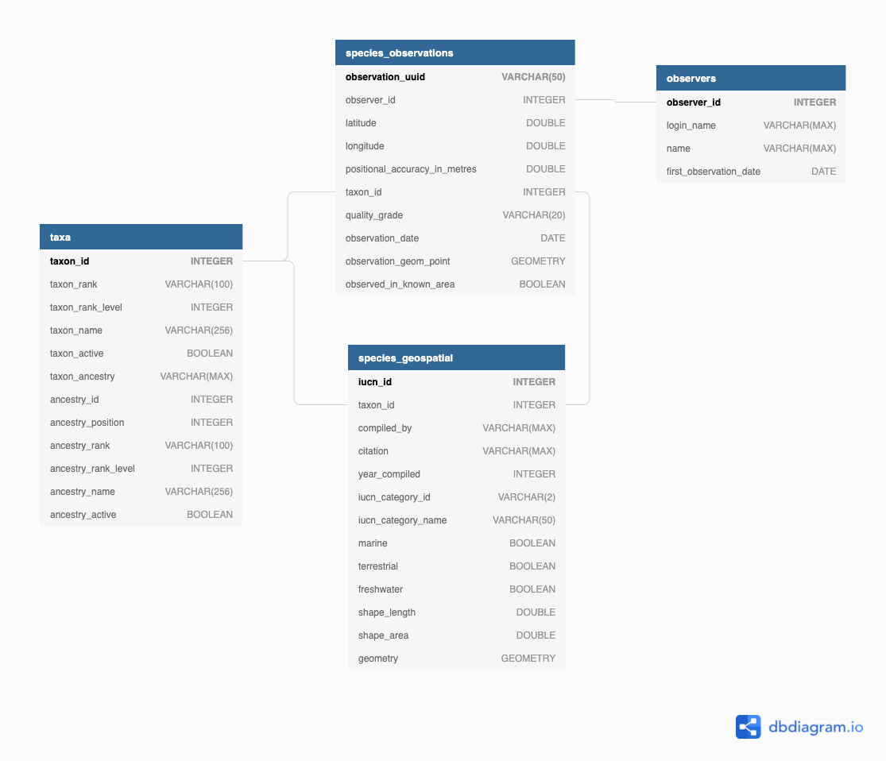

## Introduction  
This project uses Apache Airflow to automate a data pipeline in order to generate a data warehouse of iNaturalist Licenced 
Observation Open Image Data and International Union for Conservation of Nature (IUCN) Red List spatial data.

By combining citizen-science observations from iNaturalist with IUCN Red list spatial data, analysts will be able to 
explore the relationship between the known species distributions (spatial data) and what is being observed by citizen scientists. 

These insights could inform future research efforts. 

## Project Scope
I have limited the project scope to species in the class Amphibia. In 2022, 41% of all Amphibian species are threatened with extinction [red list]. 
While the project scope will be limited to Amphibians, the data model has been designed to be applicable to 
observation and spatial data for all living organisms. 

Some use cases for this data model could be: 
1. How many users have contributed to amphibian observations during a set period of time?
2. Are observations within the bounds of the known species distribution (plot observations co-ordinates with species distribution).
3. Should the species distribution be reassessed?
4. What is the observation cadence over the months of the year and has this changed year-on-year?  the year cou
5. Are users observing data deficient or endangered species?
6. Where are most of our observations coming from?
7. Are there iNaturalist users who are could be included in future research efforts?  

## Datasets 
### Introduction to the Data
#### iNaturalist Licensed Observation Images Open Dataset 
iNaturalist is a popular nature application where users can record and share plant and animal observation images. 
The app has a built-in peer review system that allows users to suggest or confirm identifications for their own or other users' observations, respectively. 
In addition to species identification, users can specify the location (latitude and longitude) of the observation.  
iNatualist collects millions of research-grade observations that can be used for research and conservation efforts. 

The iNaturalist Licensed Observation Images Open Dataset is one of the largest public datasets of photos of living organisms. [@1] 
This open dataset is housed and can be sourced from Amazon S3. 

This project uses the following observation metadata is available as compressed (gzip) comma-separated-values (csv) files: 
1. Taxa - a comprehensive list of taxon_ids for living organism observations
2. Observers - data about the user who made each observation
3. Observations - A record of individual observations of living organisms

Note for the purposes of this project we will not use the image data. 

#### International Union for Conservation of Nature (IUCN) Red List Spatial Data 
> The IUCN Red List of Threatened Species™ contains global assessments for more than 142,500 species. More than 80% of these (>115,000 species) have spatial data.

These assessments classify species according to one of the following categories: 
- Not Evaluated
- Data Deficient
- Least Concern
- Near Threatened
- Vulnerable
- Endangered
- Extinct in the Wild
- Extinct

These classifications as well as spatial data are important for environmental impact assessments and the protection of wildlife. 
Spatial data in the Esri shapefile format can be downloaded from [iucnredlist.org](https://www.iucnredlist.org/resources/spatial-data-download).
For this project, I downloaded the Amphibian shapefile which includes polygon shapes for: 

- Tailless Amphibians (species from the order Anura)
- Tailed Amphibians (species from the order Caudata)
- Caecilian Amphibians (species from the order Gymnophiona)

### Data Exploration
Data exploration can be viewed in the [Data Exploration.ipynb](Data Exploration.ipynb)

## Data Model 
The data model was designed to facilitate data analytics based on the questions outlined in the Project Scope Section.  
The data model contains 4 tables. I have kept the table names for the iNaturalist tables, but have renamed the Amphibian
shapefile to `species_geospatial`. 

The data model has 1 fact table, the iNaturalist `observations` table which has been filtered to only include species observations 
from the Amphibian class. 

The dimension tables: 
- taxa - hierarchical dimension table facilitating easy grouping/ roll ups of taxons 
- observers - a filtered table showing users who have made at least one Amphibian observation 
- species_geospatial - geospatial data specific for to species. This also includes the IUCN Red List Category 

### 1. Taxa
The raw iNaturalist `taxa` table was transformed by splitting out the ancestry field. The ancestry field is a string of taxon_ids
corresponding to the particular taxon's ancestry. 
The ancestry for the species *Amolops jaunsari* (taxon_id = 25900) is listed as `48460/1/2/355675/20978/20979/25473/25869`, 
each of the taxon_ids in this field correspond to a higher level taxon and describes the ancestry of the species. 

To allow easy data aggregation we split the ancestry field out into an ancestry_id and cross joined this to the original record. 
This way there will be a record per taxon ancestry_id for every record.
As a result, `taxa` table is much larger than the original table. At the time of writing there are just over 100K rows.

The `taxon_id` is used as the distribution key, this is based on the fact that most joins between tables will be on taxon_id. 
In addition after transformation, there will be multiple records per taxon_id to split out the ancestry column into multiple rows. 
The data will be fairly evenly distributed (see `taxa_dist_sql` code in sql_checks.py): 
- the minimum rows per taxon_id will be 1 (this is for the taxon_id that has the highest rank) 
- the maximum rows per taxon_id will be 11 (for the lowest ranked taxon_ids) 
- the average rows per taxon_id is 8 
- the median rows per taxon_id is 9 

The `taxon_rank` and `ancestry_id` columns were chosen as the sort keys because most operations will filter by ancestry in order to return 
a single record per taxon of interest. 
For example, if we wanted to count the number of Amphibian species in the `taxa` table, 
we would filter by the "species" `taxon_rank` and the `ancestry_id` for the "Amphibia" class.

### 2. Observers
The raw `observers` table was filtered for observations that were made for any taxon associated with the "Amphibia" class.
As there are not many observers, we will distribute the data across all nodes of the cluster. 

### 3. Species Geospatial
As the raw dataset contained Amphibian spatial data only, no filtering was required. 
This table was joined ot the `taxa` table at a species level in order to retrieve the iNaturalist `taxon_id`. 
I decided to keep this data separate from the `taxa` table because the spatial data is specific for species and 
can contain more than one record (multiple geometries) per species. 
This table uses the taxon_id as the distribution key. 

### 4. Observations
The iNaturalist `observations` table is the fact table for this data warehouse. 
During the transformation step, the observations are filtered for taxons that fall within the "Amphibia" class. 
I used the `longitude` and `latitude` fields to generate a geometry point which was then checked against the `species geospatial`
table to see if the observation fell within the bounds of the known species distributions.
This table used the `taxon_id` as the distribution key and the `observed on` date field as the sort key.
	

## References
[^1] iNaturalist Licensed Observation Images was first accessed on 2022-01-01 from https://registry.opendata.aws/inaturalist-open-data.
[^2] IUCN Spatial Data Download on 2022-01-01 from https://www.iucnredlist.org/resources/spatial-data-download

IUCN 2021. The IUCN Red List of Threatened Species. 2021-3.
https://www.iucnredlist.org. Downloaded on 2021-12-23.